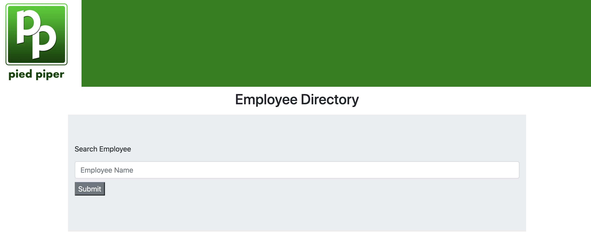
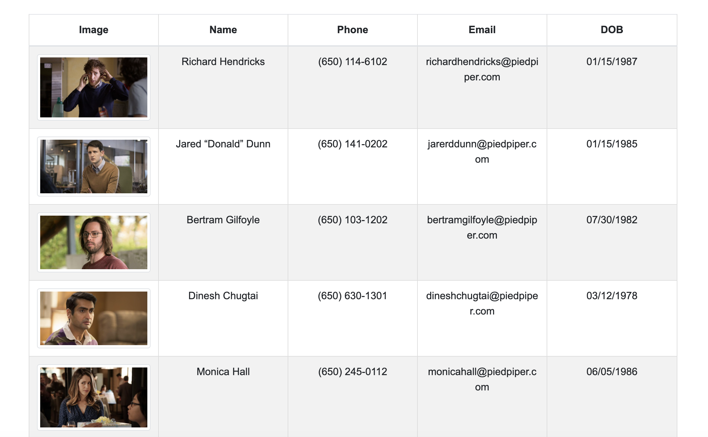

# Employee Directory

[CLICK HERE FOR LIVE APPLICATION](#)

## Table of Contents
* [Screenshots](#screenshots)

* [User Story](#user-story)

* [Application Description](#application-description)

* [Usage](#usage)

* [Demo](#demo)

* [Built With](#built-with)


* [License](#license)

* [Questions](#questions)

## Screenshots 




## User Story
```
As a user, I want to be able to view my entire employee directory at once so that I have quick access to their information.

```

## Application Description
This is a react.js application that allows user to view and sort employees by name. If you click name it will sort the employees by name. The page is broken up into components, a searchbar, navbar, title, and table. The search bar is currently not functional however if you look in the console.log you will see that the filter is working but the table is not updating, I plan to resoilve this problem soon.


## Usage 
```
                                     
Use the live application via the githubpages link provided above

```

## Demo


## Built With
* react.js
* bootstrap
* JSON
* JQuery 


## License

[](https://opensource.org/licenses/MIT)

Copyright 2020 ©Max Goldstein

<sup>Permission is hereby granted, free of charge, to any person obtaining a copy of this software and associated documentation files (the "Software"), to deal in the Software without restriction, including without limitation the rights to use, copy, modify, merge, publish, distribute, sublicense, and/or sell copies of the Software, and to permit persons to whom the Software is furnished to do so, subject to the following conditions:
  
<sup>The above copyright notice and this permission notice shall be included in all copies or substantial portions of the Software.
  
<sup>THE SOFTWARE IS PROVIDED "AS IS", WITHOUT WARRANTY OF ANY KIND, EXPRESS OR IMPLIED, INCLUDING BUT NOT LIMITED TO THE WARRANTIES OF MERCHANTABILITY, FITNESS FOR A PARTICULAR PURPOSE AND NONINFRINGEMENT. IN NO EVENT SHALL THE AUTHORS OR COPYRIGHT HOLDERS BE LIABLE FOR ANY CLAIM, DAMAGES OR OTHER LIABILITY, WHETHER IN AN ACTION OF CONTRACT, TORT OR OTHERWISE, ARISING FROM, OUT OF OR IN CONNECTION WITH THE SOFTWARE OR THE USE OR OTHER DEALINGS IN THE SOFTWARE.

## Questions

If you have any questions regarding this repo, please contact me via Github or email.

 Max Goldstein
* Github: [maxgoldstein93](https://github.com/maxgoldstein93) 
* Email: <magoldstein93@gmail.com>
